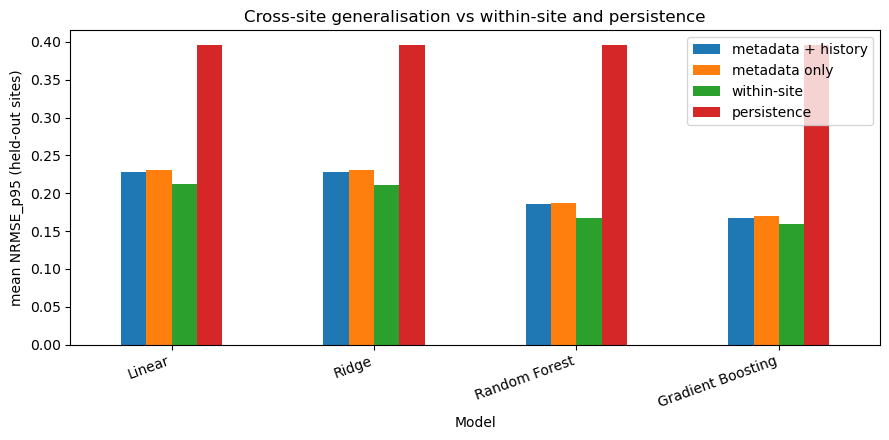
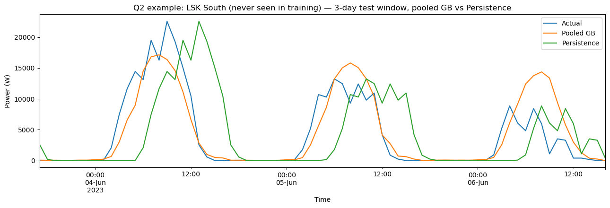

# Solar PV Power Forecasting with Machine Learning

Short-term forecasting of rooftop solar photovoltaic (PV) power output across a 60-station fleet, using classical machine learning. Built as Year 3 coursework for **PHYS30053 — Advanced Computational Physics & Machine Learning** at the University of Bristol.

📄 **[Full report (PDF)](report.pdf)** · 📓 **[Analysis notebook](Jacob_Brooke_CW2.ipynb)**

## Overview

Two forecasting problems are tackled using three years (2021–2023) of 5-minute PV generation data and 1-minute on-site weather data from 60 grid-connected rooftop PV stations in Hong Kong:

1. **Per-site forecasting (Q1)** — train one model per installation on its own history and predict its output 4 hours ahead.
2. **Cross-site generalisation (Q2)** — train a single pooled model and forecast output at installations it has *never seen*, using only installation metadata (rated power, tilt, azimuth, altitude, optimiser status), calendar features, and weather.

Seven model classes are benchmarked against a persistence baseline: Linear Regression, Ridge, Lasso, Decision Tree, Random Forest, Gradient Boosting, and an MLP neural network.

## Headline results

**Q1 — per-site models** (57 quality-filtered sites, held-out chronological test sets, NRMSE normalised by training P95):

| Model | Mean NRMSE (full test) | Mean NRMSE (daylight only) | Beats persistence |
|---|---|---|---|
| Gradient Boosting | **0.161** | **0.207** | 98.2% of sites |
| Random Forest | 0.169 | 0.218 | 98.2% |
| MLP | 0.171 | 0.217 | 98.2% |
| Decision Tree | 0.180 | 0.232 | 98.2% |
| Ridge / Linear / Lasso | ~0.22 | ~0.29 | 98.2% |
| Persistence baseline | 0.393 | 0.545 | — |

**Q2 — cross-site generalisation** (pooled model on 32 sites, tested on 8 fully unseen sites): pooled Gradient Boosting reaches a mean NRMSE of **0.169 with site history** and **0.169 without any site history (metadata + weather only)** — within ~0.01 NRMSE of dedicated within-site models (0.159) and far ahead of persistence (0.396). A leave-one-site-out spot check across the rated-power range confirms the result is not an artefact of one lucky split.



## Methodology highlights

- **Leakage-aware design throughout**: chronological train/test splits per site, hyperparameters chosen on an inner validation split, error normalisation computed from training data only, and site quality filtering using training-period statistics only.
- **Physically motivated evaluation**: daylight-only NRMSE is reported alongside full-test NRMSE, since predicting zero at night is trivially correct and flatters naive baselines.
- **Rule-based site quality filtering**: interpretable checks (implausible metadata, weak power–irradiance correlation, excessive missing weather data, short history) reduce 60 stations to 57 clean sites before model comparison.
- **Honest failure analysis**: hard cases are shown alongside typical ones (e.g. a 249.5 kW multi-inverter site with mixed panel orientations that static metadata cannot capture), plus the single site where persistence beats every supervised model.
- **Appendices** cover baseline hierarchies, multi-horizon degradation (1–24 h ahead), a weather-feature ablation, feature importances, and predicted-vs-actual diagnostics.

## Example forecasts

Typical and hard single-site cases (Q1):

_SQ8_typical_(b)_Zone_A2_hard.png>)

Forecasting a site the pooled model has never seen (Q2):



## Data

The dataset is **not included** in this repository (≈1 GB). It is openly available on Dryad:

> Lin, Z., Zhou, Q., Wang, Z., Wang, C., Bookhart, D., Leung-Shea, M. *A high-resolution three-year dataset supporting rooftop photovoltaics (PV) generation analytics.* [https://doi.org/10.5061/dryad.m37pvmd99](https://doi.org/10.5061/dryad.m37pvmd99)

To reproduce the analysis, download the dataset and place the extracted `doi_10_5061_dryad_m37pvmd99__v20240908` folder anywhere at or above the notebook's directory — the notebook locates it automatically by searching upwards from the working directory.

## Running the notebook

```bash
pip install numpy pandas matplotlib scikit-learn jupyter
jupyter notebook Jacob_Brooke_CW2.ipynb
```

The full multi-site pipeline (data loading, hyperparameter sweep, cross-site experiments) takes a while to run end-to-end; all main settings are collected in a single `CONFIG` dictionary at the top of the notebook.

## Repository structure

```
├── Jacob_Brooke_CW2.ipynb   # Full analysis notebook (pipeline, experiments, figures)
├── report.pdf               # Written report
├── plots/                   # Figures used in the report
└── README.md
```

## Use of generative AI

AI assistants were used as coding aids for parts of the implementation (data-loading refactors, experiment scaffolding, plotting code), with contributions attributed inline in the notebook. The problem framing, experimental design, failure-mode diagnoses, and interpretation of results are my own — see the disclosure section at the top of the notebook.
